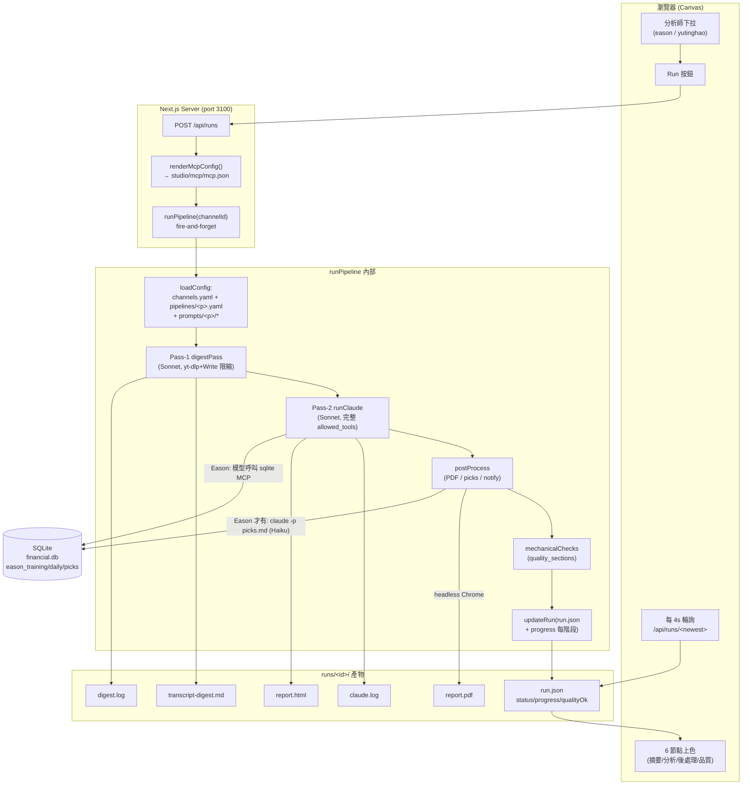
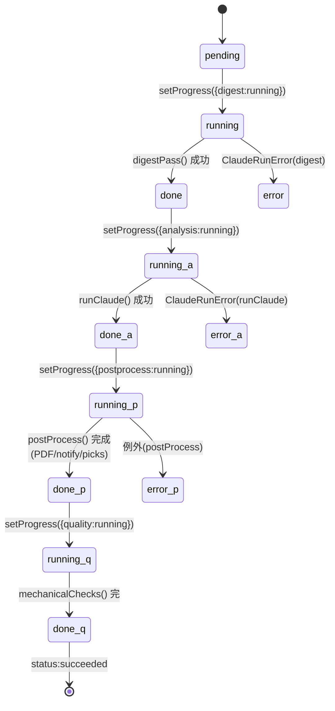
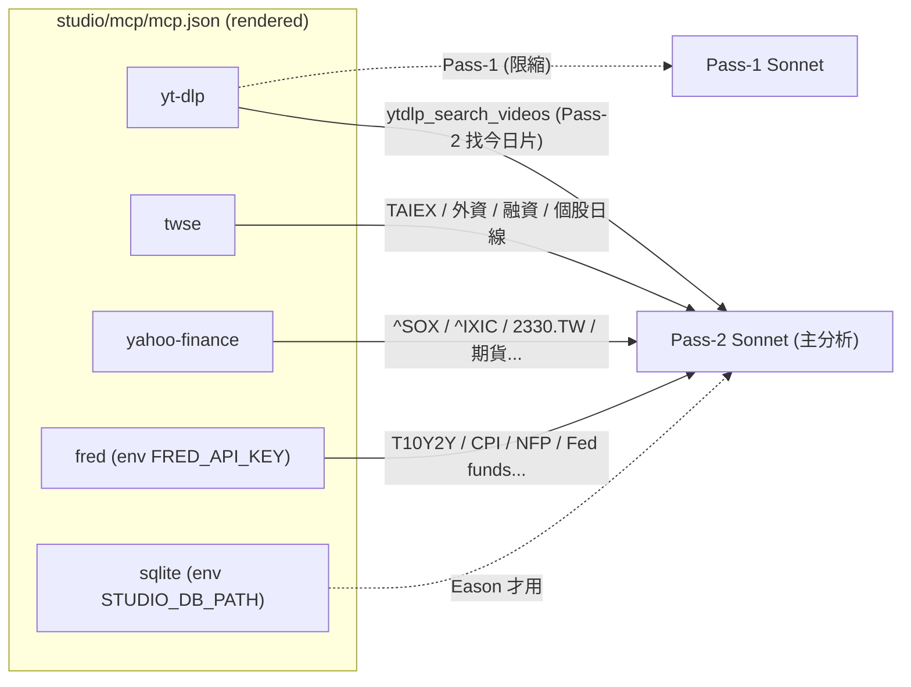
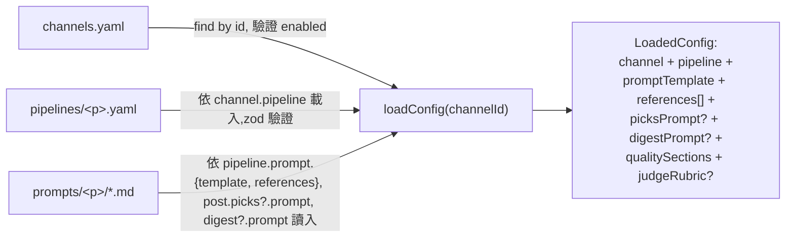
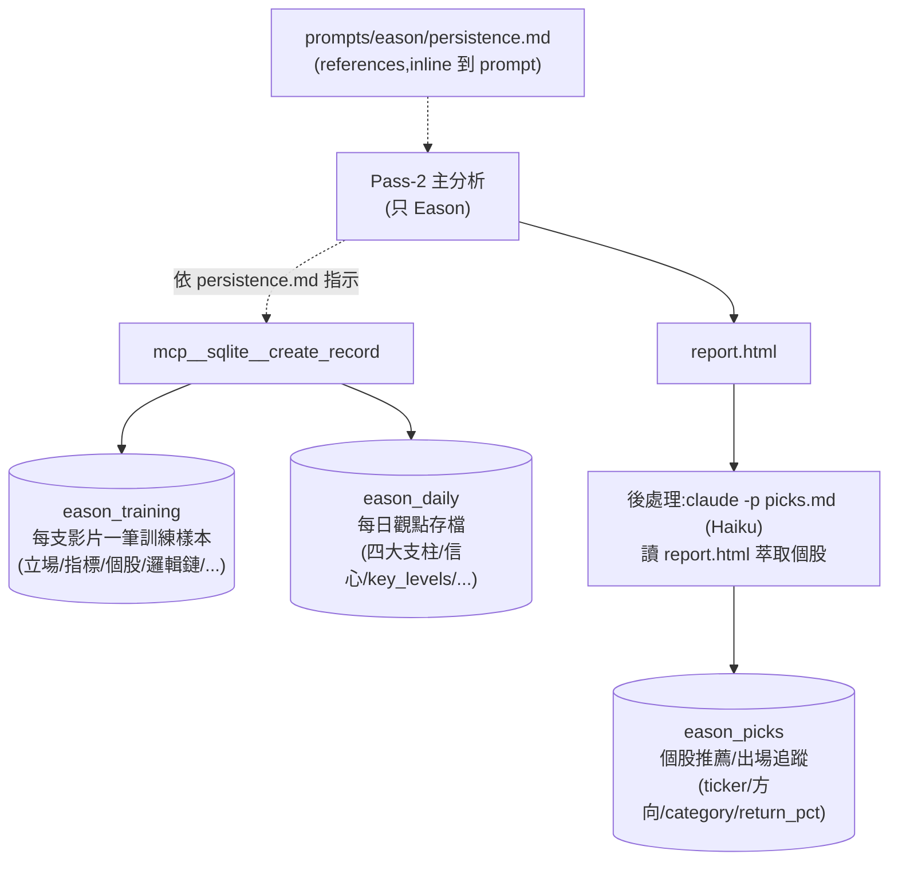

# 報告資料流（Report Data Flow）

> **最後更新**：2026-05-20 · 對應 commit `f3f422a` 之後的 `main`
> 這份文件描述 agent-flow-studio **目前實際**的資料流(以程式碼為準,不是設計願景)。

## 0. TL;DR(三句話)

當你在畫布按下 **Run**,瀏覽器送 `POST /api/runs {channelId}` 給 Next 伺服器,伺服器 fire-and-forget 啟動 `runPipeline(channelId)` —— 它先用 **Sonnet 第一趟**把 YouTube 逐字稿分頁讀完寫成一份小而忠實的摘要(`transcript-digest.md`),再用 **Sonnet 第二趟**讀那份摘要 + 同時呼叫 5 個 MCP 資料外掛(yt-dlp / TWSE / Yahoo / FRED / SQLite)做完整分析、把 HTML 報告寫到 `runs/<id>/report.html`,並在過程中(只限 Eason)把訓練樣本、每日觀點寫進 SQLite。然後 **後處理**用 headless Chrome 轉 PDF,Eason 另外跑一支 Haiku 把報告裡的個股萃取進 `eason_picks`;**品質檢查**抓 HTML 看必填段落齊不齊;runner 每一階段把 `progress` 寫進 `run.json`,畫布每 4 秒輪詢回來上色。

---

## 1. 一個 Run 的鳥瞰圖



---

## 2. 兩個 pipeline 的對照(eason vs yutinghao)

兩條 pipeline 共用同一個 runner,只在「設定 + prompts」分歧 —— **加新分析師=純設定**。

| 軸 | eason(台股實戰) | yutinghao(總經由上而下) |
|---|---|---|
| `channels.yaml` id | `eason` | `yutinghao`(原本 disabled,2026-05-20 啟用) |
| `pipelines/<id>.yaml` | `eason.yaml` | `yutinghao.yaml` |
| `prompts/<id>/` | `main, framework, voice, persistence, transcript, picks, digest, judge-rubric` + `report.css` | `main, framework, voice, transcript, digest` |
| `allowed_tools` | 15 個(含 5 個 TWSE + sqlite 三支) | 9 個(無 sqlite,只 2 個 TWSE) |
| `post.picks` | 有(Haiku 萃取個股→eason_picks) | 無(總經派不選股) |
| `quality_judge` | 有(載入但 runner 目前未消費) | 無 |
| `quality_sections` | `指標儀表板/邏輯鏈/今日語錄/風險提示/報告總結` | `市場快照/總經觀點/關鍵數據/風險/報告總結` |
| 寫入 DB | `eason_training` + `eason_daily` + `eason_picks` | **不寫**(無持久化) |
| 報告風格 | 個股級、由下而上、偏多選股 | 總經級、由上而下、中性偏謹慎、不選股 |

`schema.ts` 已把 `post.picks` / `quality_judge` 改成可選、`allowed_tools` 改成必填,所以 yutinghao 缺項合法。

---

## 3. 兩趟式(Two-Pass)——為什麼要這樣設計

### 3.1 為什麼分兩趟

> KG: `FU-5 two-pass prompt contract`

歷史上(FU-4)我們試過「一趟,把整份清乾淨的逐字稿當 MCP 工具結果整包丟給分析模型」—— 5.9 萬字超過模型對單一 MCP 工具結果能可靠消化的上限,而中段省略會破壞分析需要的連續引用 → 信心值只有 4.5/10、沒有真實選股。

FU-5 的解法是「**先用一個專責的 Sonnet 把整份逐字稿分頁讀完,寫成小而忠實的摘要;主分析只讀那份摘要**」—— 信心值從 4.5 升到 7.5,引用、選股、報告段落都恢復。

```mermaid
sequenceDiagram
  autonumber
  participant R as runPipeline
  participant D as Pass-1 Sonnet<br/>(digestPass)
  participant Y as yt-dlp MCP
  participant FS as runs/&lt;id&gt;/
  participant A as Pass-2 Sonnet<br/>(runClaude)
  participant M as TWSE/Yahoo/FRED MCP
  participant S as sqlite MCP

  R->>D: 啟動,只給 yt-dlp+Write+Read 工具
  D->>Y: ytdlp_search_videos(channel.search_query)
  Y-->>D: 影片清單
  loop 逐頁直到 page == total_pages-1
    D->>Y: ytdlp_transcript_page(url, page=n, size=12000)
    Y-->>D: 一頁清乾淨的逐字稿
  end
  D->>FS: Write transcript-digest.md (5~10KB)
  D-->>R: digest 完成

  R->>A: 啟動,給完整 allowed_tools<br/>prompt 含 ${TRANSCRIPT_DIGEST}
  A->>FS: Read transcript-digest.md (小、易消化)
  par 同時拉真實數據
    A->>M: twse/yahoo/fred MCP 呼叫
    M-->>A: TAIEX/外資/^SOX/T10Y2Y...
  and Eason 才有
    A->>S: mcp__sqlite__create_record<br/>(eason_training/daily)
  end
  A->>FS: Write report.html
  A-->>R: 分析完成
```

### 3.2 兩趟契約(prompt 角色分工)

- **`prompts/<id>/digest.md`** —— Pass-1 拿到。指示:`ytdlp_search_videos` → 逐頁 `ytdlp_transcript_page` → 用嚴格 schema `Write` 到 `${TRANSCRIPT_DIGEST}`,**寧可漏、嚴禁臆測**、原話必須逐字、source=none 也要寫出檔案。本輪只准 yt-dlp + Write/Read。
- **`prompts/<id>/transcript.md`** —— Pass-2 references。指示:**禁止**呼叫 yt-dlp,用 `Read` 讀 `${TRANSCRIPT_DIGEST}`,摘要 = 權威逐字稿依據。
- **`prompts/<id>/main.md`** —— Pass-2 主 template。產出 HTML 報告結構、寫作鐵則、強制段落清單。
- **`prompts/<id>/framework.md` / `voice.md`** —— 該分析師的分析框架(Eason:5 層籌碼;游庭皓:top-down 總經)與語氣規範。
- **`prompts/eason/persistence.md`**(只 Eason 有)—— 指示模型何時呼叫 `mcp__sqlite__create_record` 寫進 eason_training / eason_daily(這就是「持久化在分析回合內」的原因)。
- **`prompts/eason/picks.md`**(只 Eason 有,給後處理 Haiku 用)—— 讀已產出的 `report.html` 萃取個股 → 寫 `eason_picks`。

---

## 4. Runner 的 4 個可觀測階段 + 進度回報



**每個轉換**都 `updateRun(o.runsRoot, runId, { progress: { ...progress } })` —— 把完整 progress 物件(shallow-merge 限制)寫進 `run.json`,所以 `/api/runs/[id]` 一抓出來,前端就拿得到即時狀態。

**節點對應**(`nodeRunStatus`):
- `digest / analysis / postprocess / quality` → 直接讀 `progress[id]`(`pending|running|done|error|skipped`)
- `channels` → 永遠 neutral(設定不是執行步驟)
- `persistence` → **衍生**:run `status === succeeded` 才標 done,否則 pending(因為持久化發生在 Pass-2 claude turn 內部,runner 看不見那一刻 —— 這是已記錄的誠實限制)

---

## 5. 五個 MCP 資料外掛(Pass-2 的數據扇入)



每個 server 是一隻獨立的 Python FastMCP(`studio/mcp/servers/*.py`),由 `claude -p --mcp-config studio/mcp/mcp.json --strict-mcp-config --allowedTools …`啟動。
- **`@PY@`** = `studio/mcp/.venv/bin/python`
- **`@FREDKEY@`** = 從繼承工具的 `financial-report-system/scripts/.env` 取
- **`@DBPATH@`** = `financial-report-system/data/financial.db`
- `--allowedTools` 限縮成該 pipeline 的 `allowed_tools` 子集(yutinghao 沒有 sqlite,Pass-1 又再縮成只 yt-dlp+Write+Read)

---

## 6. 設定載入鏈(channel → pipeline → prompts)



- **schema 強制**:`allowed_tools` 必填非空;`post.picks` / `quality_judge` / `digest` 可選。
- **`pipelineStore`(canvas 側欄編輯用)**:可寫入的 pipeline 名單從 `channels.yaml` 推導(任何 channel 引用的 pipeline 都能編)—— 不再寫死 `{"eason"}`。
- **零 TS 擴充**:加新分析師 = 新增 channels.yaml 一筆 + `pipelines/<新>.yaml` + `prompts/<新>/*`,**lib/app/components 不用改任何一行**(已實證 grep = 0)。

---

## 7. Prompt 模板代換 conventions

> KG: `agent-flow-studio: prompt asset locations and placeholder conventions`

`buildPrompt()` 對 prompt 文字統一做以下代換:

| Token | 來源 |
|---|---|
| `{{calendar}}` | `calendarFacts(now).text`(今日日期+星期,Pass-2 注入) |
| `{{report_css}}` | `prompts/eason/report.css` 內容(Pass-2 注入) |
| `{{channel.handle}}` / `{{channel.name}}` / `{{channel.search_query}}` | 該 channel 設定 |
| `${HTML_FILE}` | `runs/<id>/report.html` 絕對路徑 |
| `${DATE}` | `cal.iso`(YYYY-MM-DD) |
| `${LOG_FILE}` | `runs/<id>/claude.log` |
| `${TRANSCRIPT_DIGEST}` | `runs/<id>/transcript-digest.md`(兩趟式契約的核心) |

picks prompt 同樣經 `buildPrompt` —— 不然 `${HTML_FILE}` 會以字面傳給 Haiku,寫不進 eason_picks(這就是 FU-6 修的 bug)。

---

## 8. 持久化:Eason 三張表 vs 游庭皓 0 張表



去重規則寫在 prompts:同一 `video_id` 不重複寫 `eason_training`;`(ticker, pick_date)` 已存在就跳過 picks。
游庭皓沒有 `post.picks` 也沒有 `persistence.md` reference → runner 跳過後處理 picks 步驟,模型也不會去呼叫 sqlite(`allowed_tools` 本來就沒給 sqlite)。

---

## 9. 一個 run dir 長什麼樣

```
studio/runs/2026-05-19T19-18-39-101Z_yutinghao/
├── run.json              ← 狀態機:status / progress / qualityOk / error / pid / configSnapshot
├── transcript-digest.md  ← Pass-1 產出(小、忠實、有逐字原話)  5~10KB 典型
├── digest.log            ← Pass-1 claude -p 的 stdout/stderr
├── claude.log            ← Pass-2 claude -p 的 stdout/stderr(失敗時偵錯關鍵)
├── report.html           ← Pass-2 寫的最終報告(21~29KB 典型)
└── report.pdf            ← postProcess 用 headless Chrome 轉的(1.5~2MB)
```

`runs/` 是 gitignored;`_e2e*.log` / `_fu*_launch.log` 這類舊 ad-hoc 殘留會被 `isRunId` 過濾掉、不會被 `/api/runs` 列出。

---

## 10. 畫布側的整條鏈(從你按 Run 到節點上色)

```mermaid
sequenceDiagram
  participant U as 你(瀏覽器)
  participant RB as RunBar
  participant API as Next /api/runs
  participant R as runPipeline
  participant FS as runs/&lt;id&gt;/run.json

  U->>RB: 選分析師 + 按 Run
  RB->>API: POST {channelId}
  API->>API: loadConfig → allowed_tools<br/>renderMcpConfig (best-effort)
  API->>R: fire-and-forget runPipeline(channelId, {mcpConfigPath, allowedTools, ...})
  API-->>RB: {started:true}
  loop 每 4 秒(僅 newest=running/pending 時)
    RB->>API: GET /api/runs → newest ids
    RB->>API: GET /api/runs/&lt;newest&gt; → progress
    Note over R,FS: runner 每階段都 setProgress() → 即時寫 run.json
    R->>FS: progress.digest:done<br/>progress.analysis:running ...
    API-->>RB: { status, progress }
    RB->>U: 4 個節點依 progress 上色<br/>(摘要→分析→後處理→品質)
  end
```

`持久化` 節點是衍生的(succeeded 才綠),不參與這條輪詢上色 —— 這是 v1 cosmetic limitation,有意保留。

---

## 11. 已知限制與未做事項(誠實)

- **`/api/runs` POST 渲染 mcp.json 是 best-effort**:`.env` 找不到、venv 缺、權限問題 → 不會 crash route,但 run 會用「無 MCP」模式跑,品質退化。這是刻意的優雅退化。
- **`持久化` 畫布節點 = 衍生**:runner 看不進單一 claude turn 內部,所以無法即時顯示「持久化跑中」;v1 接受這個限制。
- **`quality_judge.rubric` 載入後 runner 沒消費**:品質檢查目前是純機械的 `mechanicalChecks(quality_sections)`,judge rubric 是預留欄位。
- **游庭皓 `main.md` 仍以 `/eason-analysis` 開頭**(從 Eason 模板複製):**有效**(他的 5 段都產出來了),但繼承工具有更貼他總經風格的 `macro-analysis` skill —— 換過去是品質微調候選,不是 bug。
- **沒有「組合 briefing」**(游庭皓 + Eason 共識/分歧)—— 是下一個獨立 FU,先單獨各自跑通是刻意的順序。
- **Discord/LINE 通知 OFF**(`post.notify: false`)—— 自始未開,你最初要求略過。`runs/<id>/` 目前沒有對外推播。
- **transient 失敗會發生**:長時 `claude -p` 偶爾因網路抖動掛掉(`API Error: socket connection closed`),runner 會正確標記 `status:failed, progress.analysis:error`,但**修法是重跑、不是改程式**。

---

## 12. 一行版索引(配對到程式碼)

| 文件 | 角色 |
|---|---|
| `studio/app/page.tsx` | 畫布主頁(ReactFlow 6 節點 + RunBar + SidePanel) |
| `studio/components/canvas/RunBar.tsx` | 分析師下拉 + Run + 4s 輪詢 + onActive |
| `studio/components/canvas/StageNode.tsx` | 6 節點外觀,依 `data.runStatus` 上色 |
| `studio/app/canvas/nodes.ts` | 6 節點靜態模型 + `nodeRunStatus()`(純函式) |
| `studio/app/api/runs/route.ts` | POST 載入 pipeline allowedTools + 渲染 mcp.json + fire-and-forget runPipeline;GET 過濾 isRunId |
| `studio/app/api/runs/[id]/route.ts` | 回完整 `run.json` |
| `studio/app/api/channels/route.ts` | GET/PUT `channels.yaml`(zod) |
| `studio/app/api/pipeline/[name]/route.ts` | GET/PUT `pipelines/<name>.yaml`(allow-list 從 channels.yaml 推導) |
| `studio/app/api/prompts/route.ts` | GET/PUT 白名單路徑下的 prompt 檔 |
| `studio/lib/runner/runPipeline.ts` | 主編排,4 階段 progress,catch 映射 |
| `studio/lib/runner/digestPass.ts` | Pass-1 包裝,reducer 工具集到 yt-dlp+Write+Read |
| `studio/lib/runner/runClaude.ts` | 唯一 `claude -p` 構造點(安全縫) |
| `studio/lib/runner/postProcess.ts` | Chrome PDF / notify / picks(條件式) |
| `studio/lib/runner/allowedTools.ts` | `pipelineAllowedTools` + `digestAllowedTools` |
| `studio/lib/runner/mcpConfig.ts` | 渲染 `mcp.json` 模板(注入 FRED key/路徑) |
| `studio/lib/runner/runRecord.ts` | run.json 讀寫 + StepState/RunProgress 型別 + `isRunId` |
| `studio/lib/quality/check.ts` | `mechanicalChecks(html, qualitySections)` |
| `studio/lib/config/{schema,load,promptPaths,promptStore,pipelineStore}.ts` | 設定/prompt 安全讀寫 + zod |
| `studio/mcp/servers/*.py` | 5 個 Python MCP server |
| `studio/config/channels.yaml` | 分析師清單 |
| `studio/config/pipelines/{eason,yutinghao}.yaml` | 各 pipeline 設定 |
| `studio/prompts/{eason,yutinghao}/*.md` | 各 pipeline 的 prompts |
| `financial-report-system/data/financial.db` | SQLite,3 張 eason_* 表 |
